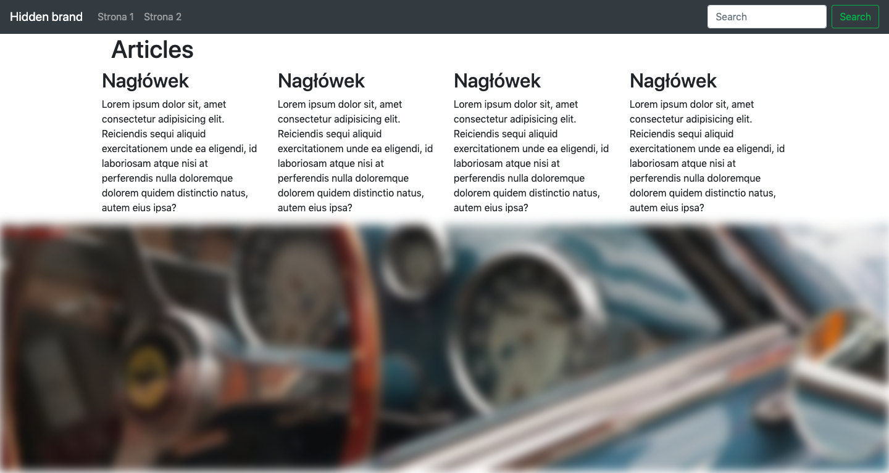

# Graphics for the Internet - Project 3

> This application was created for purpose of egzamination on university.

## Table of contents

- [General info](#general-info)
- [Screenshots](#screenshots)
- [Technologies](#technologies)
- [Setup](#setup)
- [Features](#features)
- [Status](#status)
- [Contact](#contact)

## Screenshots



## General info

This app is created for checking my understanding of webpack and boostrap.

## Technologies

- html
- scss
- js
- bootstrap 4
- webpack
- lodash - 

## Setup

```
git clone git@github.com:Szalbik/GPI_Projekt3.git
cd GPI_Projekt3
npm install / yarn install
npm run build / yarn run build
```

## Features

List of features ready and TODOs for future development

- Switching between pages
- Webpack compile js and scss
- RWD

## Status

Project is: _finished_.

## Contact

Created by [@Damian Szalbierz](https://github.com/Szalbik) - feel free to contact!
